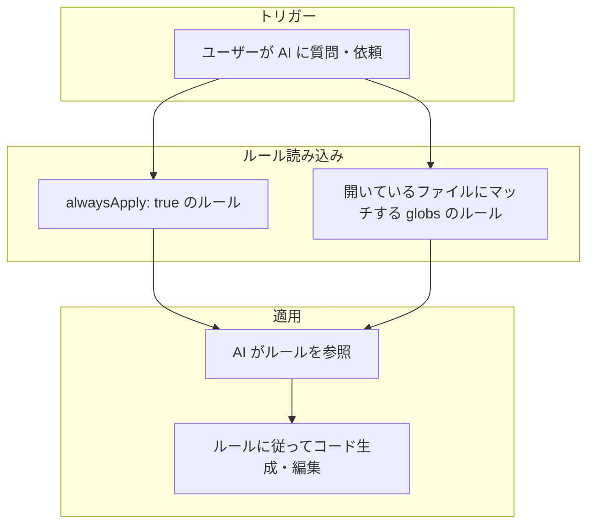
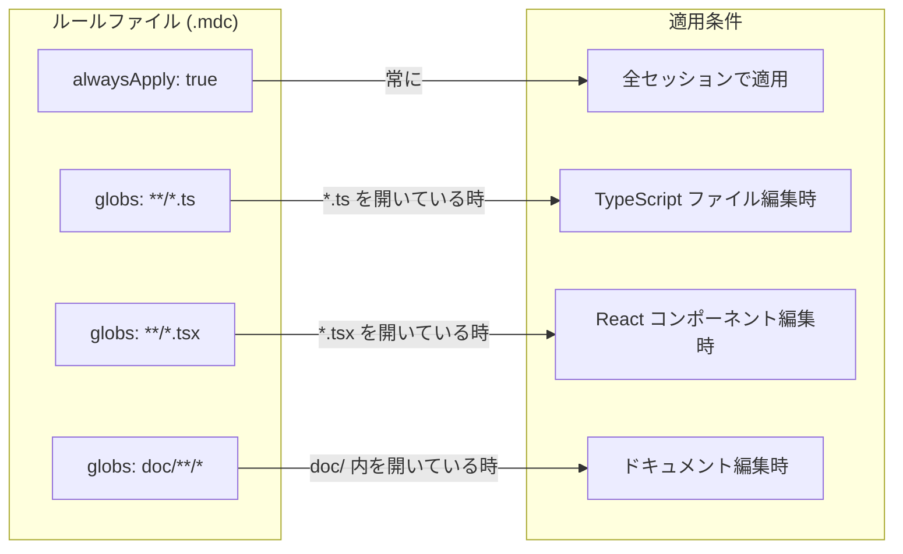
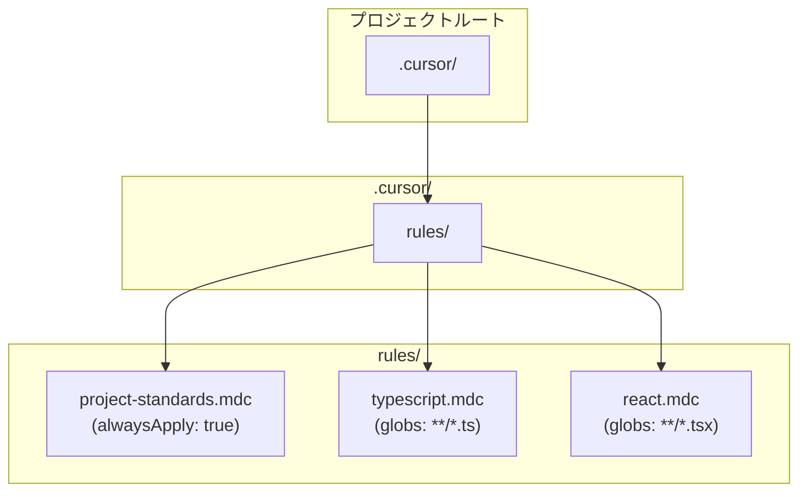
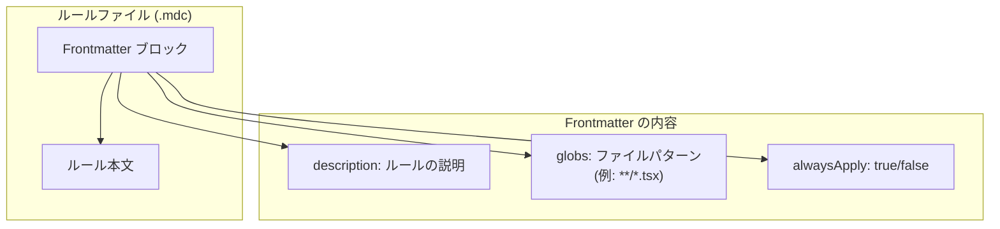
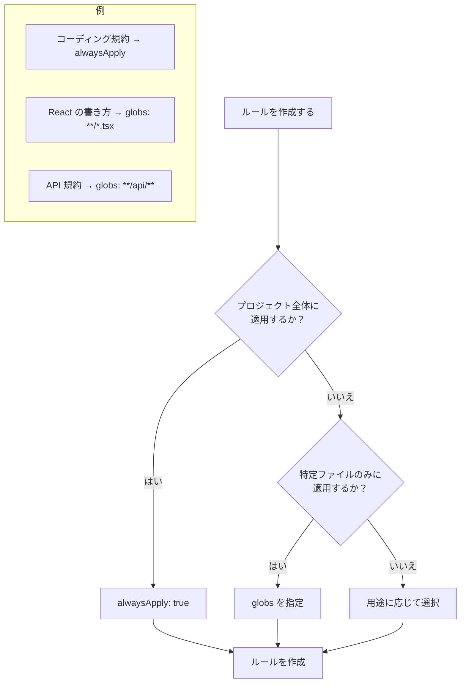

# Cursor Rules 図解

Cursor のルールシステムの構造と動作を図で説明します。

---

## 1. ルール適用の流れ

---

## 2. ルールの種類と適用条件

---

## 3. ディレクトリ構造

---

## 4. ルールファイルの構造

---

## 5. ルール作成の判断フロー

---

## 6. まとめ

| 設定 | 適用タイミング |
|------|----------------|
| `alwaysApply: true` | 常に（全セッション） |
| `globs: **/*.ts` | `.ts` ファイルを開いている時 |
| `globs: **/*.tsx` | `.tsx` ファイルを開いている時 |
| `globs: doc/**/*` | `doc/` 配下のファイルを開いている時 |

---

*このドキュメントは Cursor のルール機能の理解を助けるための図解です*
